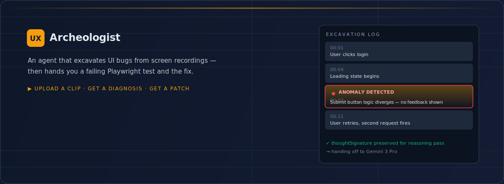
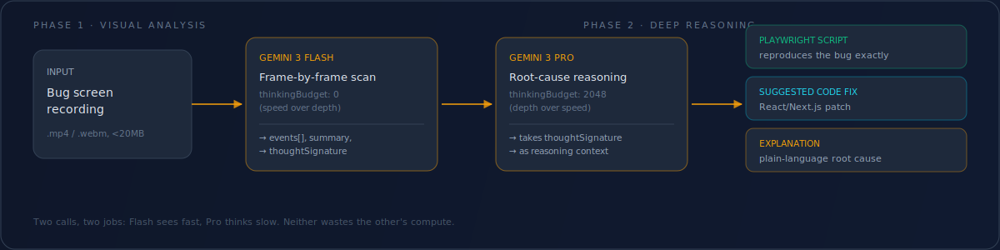

<p align="center">
  
  
  
</p>

## What it is

Bug reports are usually a screen recording and a shrug: "it does this weird thing sometimes." Someone still has to watch the clip, figure out the exact frame where things go wrong, write a test that reproduces it, then write the fix.

**UX Archeologist** does that triage for you. Upload the clip. It digs through the footage frame by frame, marks the exact moment the UI diverges from expected behavior, and comes back with a Playwright script that reproduces the bug on demand plus a suggested code fix.

## How it works




It's a two-model relay, not one big prompt:

- **Gemini 3 Flash** does the first pass — thinking disabled, optimized for speed — scanning the recording frame by frame and logging a timestamped event trail. The moment it spots the divergence, it writes a `thoughtSignature`: a compact technical description of what it saw and why, built specifically to carry context into the next call.
- **Gemini 3 Pro** picks up that signature — thinking budget cranked up — and does the actual engineering: writes a Playwright test that fails exactly the way your bug does, drafts a fix, and explains the root cause in plain language.

Splitting it this way means you're not paying deep-reasoning cost for the part of the job that's just pattern-matching pixels, and you're not asking a fast model to reason about root causes it can't actually verify.

## What you get back


- **A timestamped timeline** of the recording — what happened, what was observed, and which moment is flagged as the failure.
- **A Playwright script (TypeScript)** that reproduces the bug, ready to drop into a test suite.
- **A suggested code fix** for a typical React/Next.js component.
- **A plain-language explanation** of the root cause, so the fix isn't a black box.

## Stack


Verified against `package.json` and the source:

| Layer | Tech |
|---|---|
| Framework | React 19, Vite |
| Language | TypeScript |
| AI | `@google/genai` — Gemini 3 Flash (analysis) + Gemini 3 Pro (reasoning) |
| Output target | Playwright (TypeScript) |

## Run it locally


**Prerequisites:** Node.js, a Gemini API key.

```bash
git clone https://github.com/akhilreddy59/UX-Archeologist.git
cd UX-Archeologist
npm install
```

Set your key as `API_KEY` in the environment (the app reads `process.env.API_KEY`), then:

```bash
npm run dev
```

## Limits worth knowing


- Video uploads are capped around 20MB (inline base64 to the API) — compress or trim before uploading.
- Best results on clips under a minute; longer or corrupted files get rejected before the API call.
- This is a diagnosis tool, not a guarantee — the generated fix is a *suggestion* to review, not a patch to merge blind.

## Status


Solo project, active development. No license file yet — treat the code as all-rights-reserved until one is added.
